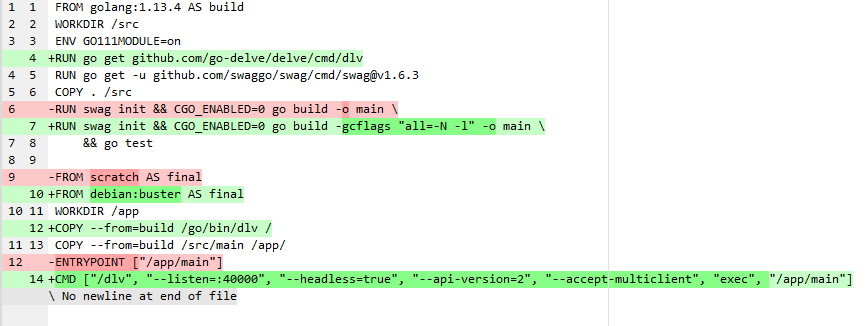
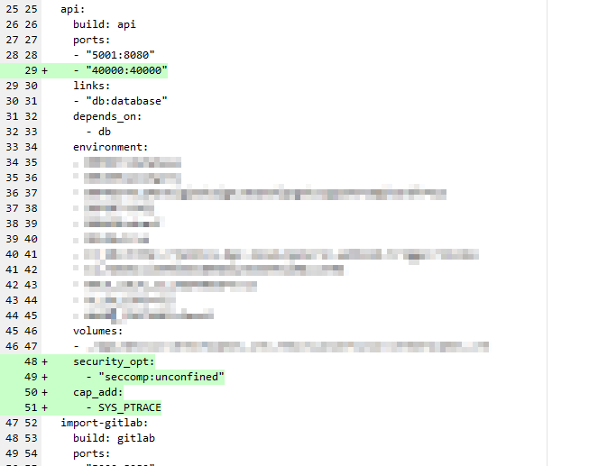
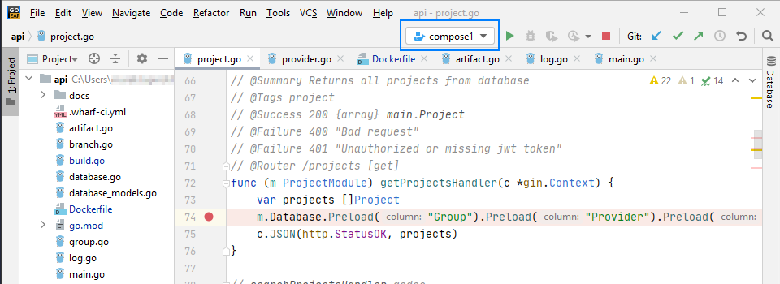
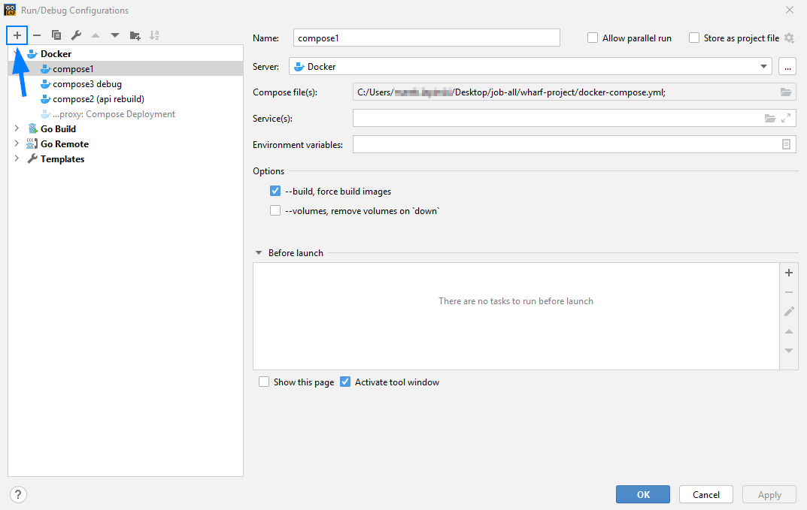
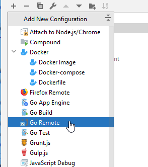
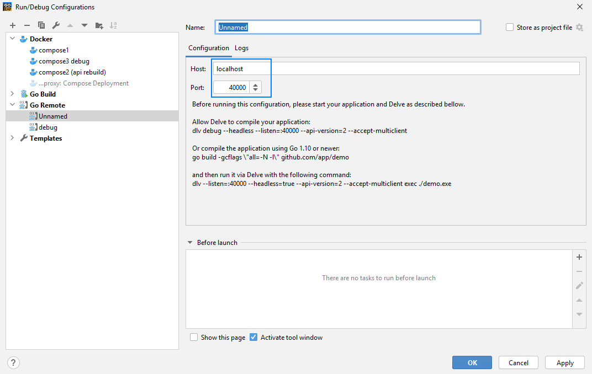
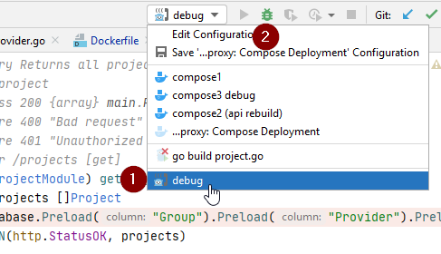

# Debugging in GoLand

<!-- panels:start -->

<!-- div:right-panel -->


> [JetBrains GoLand](https://www.jetbrains.com/go/) is an IDE for the Go
> programming language.

<!-- div:left-panel -->

Running Wharf locally is a hassle, as every code change requires you to rebuild
the entire Docker images, and you cannot connect a debugger.

It is possible to hook up [JetBrains GoLand](https://www.jetbrains.com/go/) to
accomplish this.

?> To those that have experience with the container tools in Visual Studio will
   feel right at home.

<!-- panels:end -->

## 1. Install GoLand

Download GoLand from this link: <https://www.jetbrains.com/go/download>

## 2. Open project you want to debug

Let's say it's the main API, then you open the `api` project using GoLand.

## 3. Modify the Dockerfile

1. In first step of multistage build we need to install Delve debugger:
   <https://github.com/go-delve/delve>

2. Set additional flags in `go build` command: `-gcflags "all=-N -l"`

3. In second step of multistage build use `debian:buster` image as base
   image. `scratch` and `alpine` images are throwing errors.

4. Copy needed files from first stage by running
   `COPY --from=build /go/bin/dlv /`

5. To run Delve during container start change entrypoint of container to:

   ```dockerfile
   CMD ["/dlv", "--listen=:40000", "--headless=true", "--api-version=2", "--accept-multiclient", "exec", "/app/main"]
   ```



## 4. Modify the docker-compose.yaml

1. To route traffic to delve debugger add 40000 port routing in ports part:

   ```yaml
   ports:
     - "40000:40000"
   ```

2. Add following parts on base level of api compose part.

   ```yaml
   security_opt:
     - "seccomp:unconfined"
   cap_add:
     - SYS_PTRACE
   ```



## 5. Rebuild image

Rebuild images and (re)start the services.

```bash
# docker-compose up --build --force-recreate --no-deps -d <debugged service name from dockercompose>

# For the API, that would be:
docker-compose up --build --force-recreate --no-deps -d api
```

## 6. Restart normally

Run Wharf normally with

```bash
docker-compose up
```

If everything is set up properly you should see that app container is run with
delve command and 40000 port is forwarded. See the screenshot:


## 7. Connect GoLand for debugging

When app is running properly we're ready to create debugging configuration in
Goland.

1. Open Goland editor and click following dropdown. Pick `Edit configurations`
   option.

   

2. You should see window similar to that one below. Click small plus button on
   top-left corner of the screen.

   

3. Pick "Go Remote" configuration

   

4. Add `localhost` as host and port `40000` as port. Give the name to that
   configuration. Previously I named mine `debug`. Apply changes.

   

5. Now you should be able to pick that configuration (1) and start debugging by
   pressing green bug sign (2)

   

6. If debugger will attach succesfully you will be able to see `connected`
   status. And your breakpoints will be hit :)

   
   
Done!
