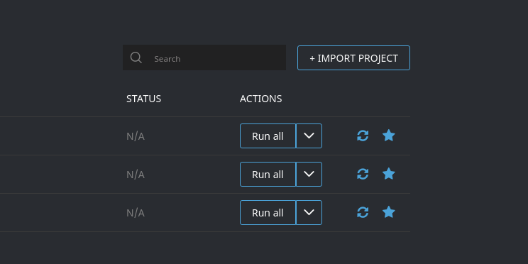
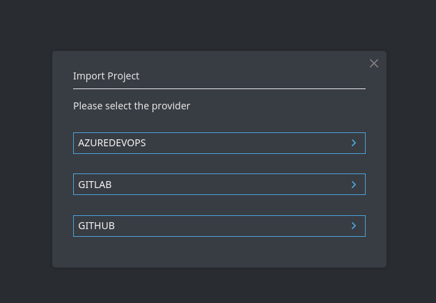

# Import projects

<!-- panels:start -->

<!-- div:left-panel -->

Wharf operates on projects it has stored in it's own database in its own
format.

To start populating the Wharf database with data from remote providers you
import those remote projects and code repositories using one of our provider
plugins.

<!-- div:right-panel -->

> A project in Wharf corresponds to a code repository in GitHub, GitLab, and
> Azure DevOps.
>
> The biggest distinction is in Azure DevOps as that term is reused.
> An Azure DevOps projects (which may contain more than one code repository)
> does not equal a Wharf project, but instead an Azure DevOps code repository
> (that lives inside an Azure DevOps project) corresponds to a Wharf project.

<!-- panels:end -->

## Prerequisites

Wharf need to be deployed with the appropriate provider component to be able
to import from a given remote provider.

- To import from <https://github.com>, [wharf-provider-github](https://github.com/iver-wharf/wharf-provider-github)
  needs to be deployed with Wharf.

- To import from <https://gitlab.com> or a self-hosted instance of GitLab,
  [wharf-provider-gitlab](https://github.com/iver-wharf/wharf-provider-gitlab)
  needs to be deployed with Wharf.

- To import from <https://dev.azure.com> or a self-hosted instance of
  Azure DevOps (formerly known as Team Foundation Server, TFS),
  [wharf-provider-azuredevops](https://github.com/iver-wharf/wharf-provider-azuredevops)
  needs to be deployed with Wharf.

If you need to import from a different remote provider, then please file a new
issue over at <https://github.com/iver-wharf/wharf-api/issues/new>.

## Using wharf-web

Easiest way to import a project into Wharf is to use Wharf's web interface,
[wharf-web](https://github.com/iver-wharf/wharf-web).

1. Up in the top right corner of the web page, click `+ IMPORT PROJECT` found
   next to the search box in the project list page.

   

2. In the popup modal, select the provider from which you wish to import from.

   

3. The form you are presented with will have different values depending on the
   provider you've chosen.

   Please refer to the different provider alternatives from the sidebar menu.
