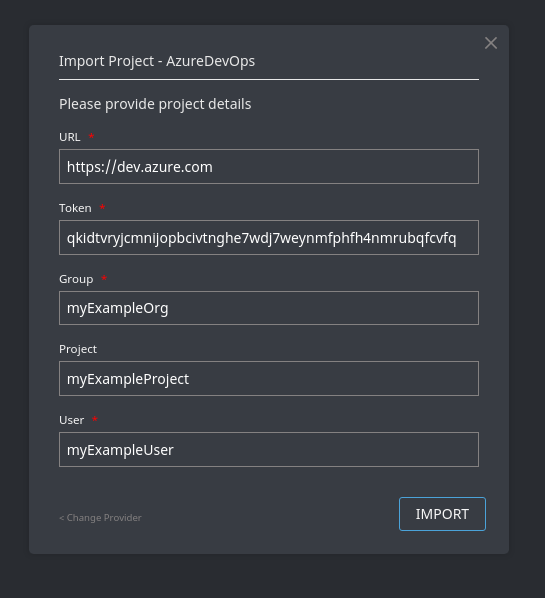
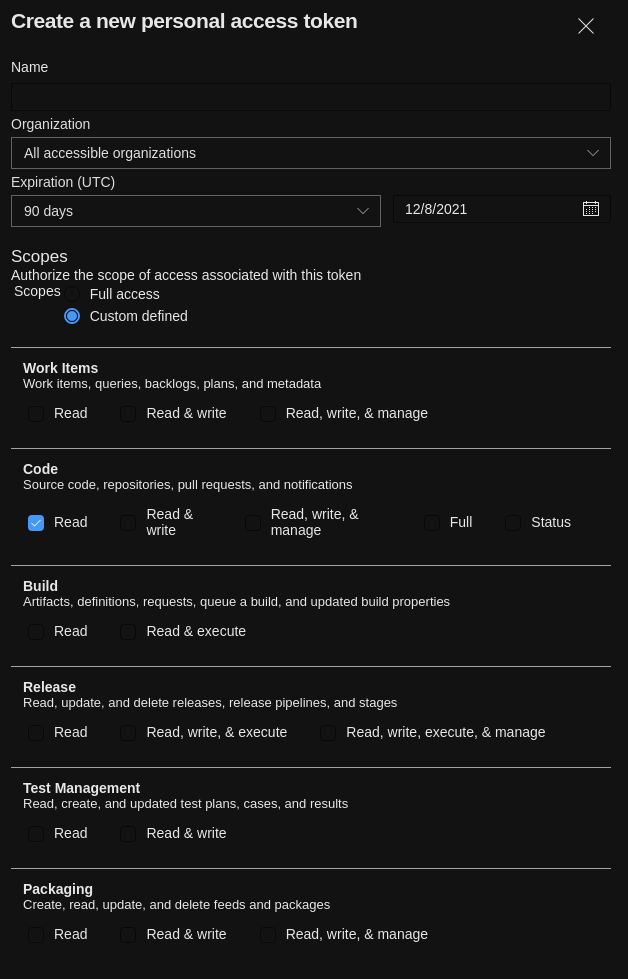

# Import from Azure DevOps

This documentation page is specific to the
[wharf-provider-azuredevops](https://github.com/iver-wharf/wharf-provider-azuredevops)
plugin.

To learn more about import projects into Wharf, please refer to the
[Importing projects](tutorials/import-projects/) page.

## Prerequisites

To import from <https://dev.azure.com> or a self-hosted instance of
Azure DevOps (formerly known as Team Foundation Server, TFS),
[wharf-provider-azuredevops](https://github.com/iver-wharf/wharf-provider-azuredevops)
needs to be deployed with Wharf.

## Import fields

<!-- panels:start -->

<!-- div:left-panel -->

When importing using Wharf's web interface, you are presented with the
following fields:

- **URL**: URL (with protocol, `https://`) of the Azure DevOps server.

  For the official <https://dev.azure.com/>, this value would be
  `https://dev.azure.com/`

- **Token**: Personal Access Token used to authenticate.

  See the below section on [#Generating a token](#generating-a-token) for more
  information about the token's scopes.

- **Group**: Name of the Azure DevOps organization (or TFS collection).

  If you wish to import an Azure DevOps code repository from
  `https://dev.azure.com/exampleorg`, then you would enter `exampleorg` into
  the *"Group"* field.

  The group may also be a username. If you wish to import projects from the
  same account as the user specified in the *"User"* field, then specify
  the same username here.

- **Project**: Name of the Azure DevOps project (not to be confused with the
  Azure DevOps code repositories).

  This field is optional. If left out, all the projects inside the given
  Azure DevOps organization (from the *"Group"* field) will be scanned for
  code repositories.

- **User**: Name of the Azure DevOps user.
 
  This must be the owner of the personal access token and is used when
  authenticating with the Azure DevOps server.

<!-- div:right-panel -->

Example:

<!-- panels:end -->

## Generating a token

Wharf needs a Personal Access Token (PAT) to authenticate with the Azure DevOps
instance.

?> It's recommended that this token is generated for a newly created service
account, meaning an account that's solely indented to be used by Wharf and not
by a human.

Tokens are generated from the "Personal access tokens" page under the
"Security" category of the user settings over at the Azure DevOps instance.
For example, if your user was named `johndoe` over at <https://dev.azure.com/>,
then you would generate your tokens from `https://dev.azure.com/johndoe/_usersSettings/tokens`.

### Token scopes

Token need nothing more than the following scope:

- **Code**\
  *Source code, repositories, pull requests, and notification*

  - [x] Read

Preview:

Recommended to set the *"Organization"* field to encompass nothing more than
the Azure DevOps organization you plan to import Azure DevOps code repositories
from.

## Token usage

It's used for:

- :heavy_check_mark: Initial import of the Wharf project.

- :heavy_check_mark: Refreshing the Wharf project, as issued via the Wharf web
  interface.

But it's not used for:

- :x: Cloning the repository. An SSH key is used for that instead.

- :x: Reporting Wharf build statuses.
  *(planned: [wharf-provider-azuredevops#5](https://github.com/iver-wharf/wharf-provider-azuredevops/issues/5))*
