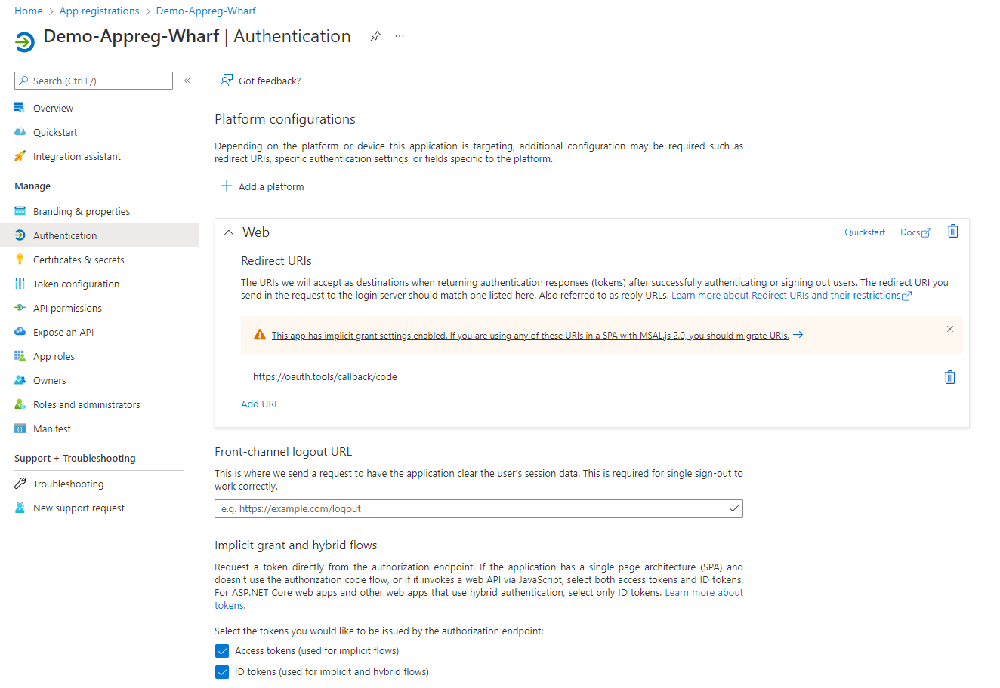
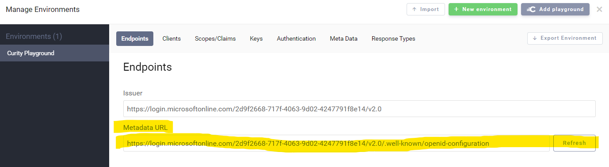
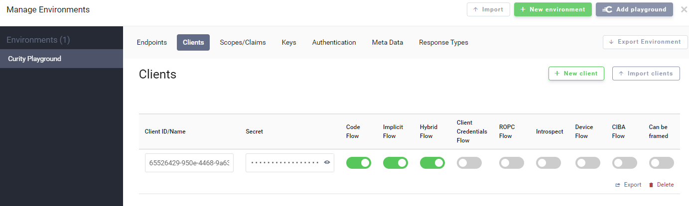
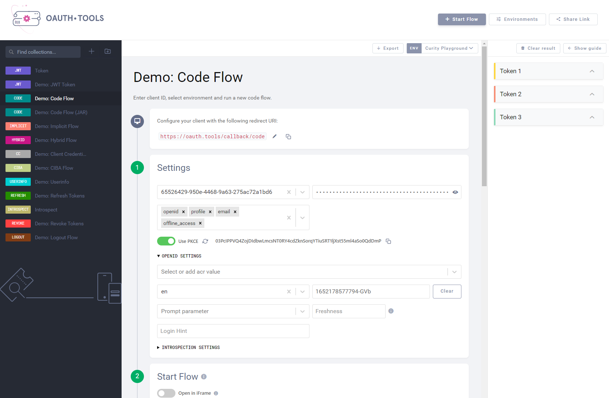

# OpenID Connect (OIDC)

[What is OpenID Connect?](https://openid.net/connect/)

> OpenID Connect 1.0 is a simple identity layer on top of the OAuth 2.0 
> protocol.  It allows Clients to verify the identity of the End-User based on 
> the authentication performed by an Authorization Server, as well as to 
> obtain  basic profile information about the End-User in an interoperable  
> and REST-like manner.
> 
> OpenID Connect allows clients of all types, including Web-based, mobile,  
> and JavaScript clients, to request and receive information about  
> authenticated sessions and end-users. The specification suite is extensible, 
> allowing participants to use optional features such as encryption of  
> identity data, discovery of OpenID Providers, and session management, when 
> it makes sense for them.
> 
> See https://openid.net/connect/faq/ for a set of answers to Frequently Asked 
> Questions about OpenID Connect.
> 

## Provider setup
Setup of full-featured OIDC contains many feature flags. This can be 
confusing to set up. Use the 
following settings and words of warning to get started.

### Create an azure app registration

In azure create a new app registration as a 'web' application. The web 
platform is used specifically for the oath-tools callback. OBS! It is not 
used in Wharf, Wharf uses the SPA type platform.
Use the callback url `https://oauth.tools/callback/code` for testing. In the 
next step of the tutorial this is used to verify the flow works.

Under the menu item `Certificates and Secrets` its possible to create a 
client secret. This is not needed for SPA platform that 
Wharf uses, however it is needed when using the (WEB) type of platform that 
oath-tools uses.

## Testing provider capabilities
Setup can be thoroughly tested at every step with https://oauth.tools/

### Set id provider target 
To start configure the id provider under `Environments` in the top right.
Input your metadata URL that got assigned to you during the id provider 
setup. Then click the refresh button to fetch all recommended settings.
See the example picture of the oath tools configuration screen.

Setup a client that has code flow capabilities. The 'Client ID' is shown in 
the azure app-registration under overview.

Save and close the config.

### Test the flow
For Wharf, we want a provider that allows us to implement the "code flow". To
test this we use the Oath-tools Code-flow.

Wharf supports the use of both PKCE and nonce to achieve the highest 
possible standard of safety.

In the shown config this flow should return 3 types of tokens.
1. Access token - This gives access to the prudent information in azure the 
   app-registration has access to. In this (default) case we get basic 
   profile information such as name, email, and some other entries. 
2. Refresh Token - This is used to simplify the process of creating new as 
   the old ones expire. This allows for the experience of staying logged-in.
3. Id Token - This is the one that mainly use with the wharf-backend it has 
   an audience entry for our azure-external api (wharf-api). 
