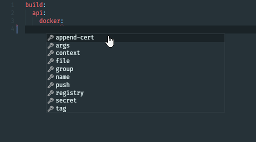

# JSON/YAML schema for `.wharf-ci.yml`

[The language server from Red Hat](https://github.com/redhat-developer/yaml-language-server#readme)
that most editors use to have YAML syntax and intellisense, has support for JSON
schemas.

Wharf has such a schema for our `.wharf-ci.yml` file.

## The JSON schema

File is hosted here: <https://iver-wharf.github.io/_static/wharf-ci-schema.json>

## Adding to Visual Studio Code

<!-- panels:start -->

<!-- div:left-panel -->

1. Install the "YAML" extension

   - ID: `redhat.vscode-yaml`
   - Link: <https://marketplace.visualstudio.com/items?itemName=redhat.vscode-yaml>

2. Add the following to your user settings:

   ```json
       "yaml.schemas":{
           "https://iver-wharf.github.io/_static/wharf-ci-schema.json": [
               ".wharf-ci.yml",
           ]
       },
   ```

3. Done!

<!-- div:right-panel -->

To test it out, open a file named `.wharf-ci.yml`. Preview:



<!-- panels:end -->
