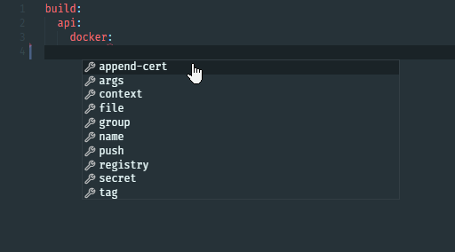
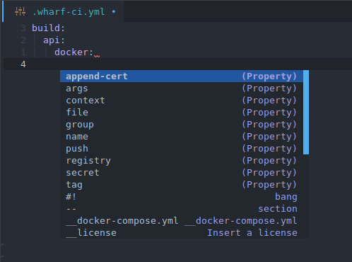
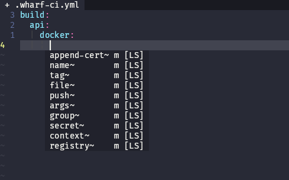

# JSON/YAML schema for `.wharf-ci.yml`

[The language server from Red Hat](https://github.com/redhat-developer/yaml-language-server#readme)
that most editors use to have YAML syntax and intellisense, has support for JSON
schemas.

Wharf has such a schema for their `.wharf-ci.yml` file.

## The JSON schema

File is hosted here: <https://iver-wharf.github.io/_static/wharf-ci-schema.json>

## Adding to Visual Studio Code

<!-- panels:start -->

<!-- div:left-panel -->

1. Install the "YAML" extension

   - ID: `redhat.vscode-yaml`
   - Link: <https://marketplace.visualstudio.com/items?itemName=redhat.vscode-yaml>

2. Add the following to your user settings:

   ```json
   {
       "yaml.schemas": {
           "https://iver-wharf.github.io/_static/wharf-ci-schema.json": [
               ".wharf-ci.yml"
           ]
       }
   }
   ```

3. Done!

<!-- div:right-panel -->

To test it out, open a file named `.wharf-ci.yml`. Preview:



<!-- panels:end -->

## Adding to Doom Emacs

<!-- panels:start -->

<!-- div:left-panel -->

1. Include the `:tools lsp` and `:lang (yaml +lsp)` settings in your `init.el`
   file (ex: `~/.doom.d/init.el`)

2. Add the following to your `config.el` file (ex: `~/.doom.d/config.el`):

   ```lisp
   (setq lsp-yaml-schemas '(https://iver-wharf.github.io/_static/wharf-ci-schema.json ".wharf-ci.yml"))
   ```

3. Sync your changes

   ```sh
   doom sync
   ```

4. When Emacs is open, press `M-x` `lsp-install-server` and then select `yamlls`

5. Done!

<!-- div:right-panel -->

To test it out, open a file named `.wharf-ci.yml`. Preview:



<!-- panels:end -->

## Adding to Vim/Neovim via Conquer of Completion (CoC)

<!-- panels:start -->

<!-- div:left-panel -->

1. Install [Node.js](https://nodejs.org/en/download/) (v10.12 or higher)

2. Install [coc.nvim](https://github.com/neoclide/coc.nvim)

   For example via [vim-plug](https://github.com/junegunn/vim-plug):

   ```vim
   Plug 'neoclide/coc.nvim', {'branch': 'release'}
   " Followed by restarting vim/nvim and then running :PlugInstall
   ```

   > Recommended to checkout [CoC's example vim configuration](https://github.com/neoclide/coc.nvim#example-vim-configuration)
   > for some useful settings, such as:
   >
   > - Use `<c-space>` to trigger completion.
   > - Make `<CR>` select the first completion and format the line.
   > - *etc.*

3. Install [coc-yaml](https://github.com/neoclide/coc-yaml)

   ```vim
   :CocInstall coc-yaml
   ```

4. Add the following to your user settings:

   ```vim
   :CocConfig
   ```

   ```json
   {
       "yaml.schemas": {
           "https://iver-wharf.github.io/_static/wharf-ci-schema.json": [
               ".wharf-ci.yml"
           ]
       }
   }
   ```

5. Done!

<!-- div:right-panel -->

To test it out, open a file named `.wharf-ci.yml`. Preview:



<!-- panels:end -->
